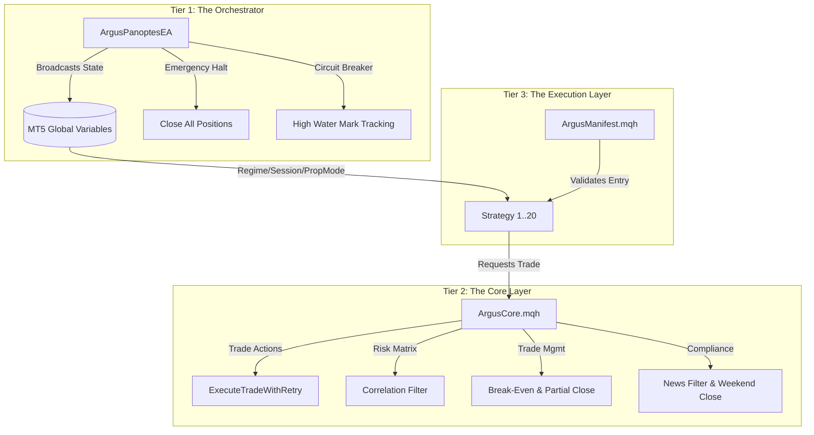

# ARGUS PANOPTES V2.0

## Institutional-Grade Algorithmic Trading Portfolio

Argus is an advanced, multi-strategy algorithmic trading framework built on MetaTrader 5 (MQL5). Version 2.0 transforms the repository from a collection of isolated Expert Advisors into a centralized, hedge-fund-style portfolio management system.

The architecture is built around a central orchestrator that actively monitors exposure, filters macroeconomic events, manages risk through a High Water Mark circuit breaker, and enforces strict operational parameters across 20 distinct quantitative strategies.

---

## LIVE BACKTEST RESULTS (Phase 5b2)

> **8.3 years · 10 instruments · 3-way out-of-sample split · Fixed parameters — no re-optimisation after the split**

| Metric | Full Portfolio | Train (2018–2022) | Validation (2023) | Test (2024–May 2026) |
|---|---|---|---|---|
| **Net Profit** | **+$125,337** | +$72,487 | +$4,316 | +$48,534 |
| **Total Return** | **+125.34%** | +72.49% | +4.32% | +48.53% |
| **Profit Factor** | **1.18** | 1.19 | 1.03 | 1.31 |
| **Max Drawdown** | **-35.99%** | -35.99% | -14.75% | -16.02% |
| **Win Rate** | **51.18%** | 53.67% | 50.53% | 47.18% |
| **Total Trades** | **3,742** | 1,960 | 665 | 1,117 |

✅ **Positive in all 3 out-of-sample splits** — including an unseen live period (2024–May 2026).

👉 **[View the interactive dashboard →](https://logiccrafterdz.github.io/Argus/)**

---

## SYSTEM ARCHITECTURE

The Argus framework is divided into three primary tiers:

### 1. The Orchestrator (Argus Panoptes)
The central intelligence of the portfolio. It acts as a master daemon running on a single chart, managing the global state of the portfolio. It is responsible for global circuit breakers, session enforcement, and broadcasting system states to all subordinate strategies.

### 2. The Shared Core (Argus Core)
A robust library of static methods shared across all strategies. It handles complex mathematical models, portfolio correlation matrices, execution retry logic, and dynamic trade management (such as Break-Even and Partial Closes).

### 3. The Execution Layer (Strategies)
20 independent Expert Advisors covering various market inefficiencies (Mean Reversion, Breakouts, Liquidity Sweeps, Trend Following). Each strategy is restricted to its specific logic and relies on the Core and Orchestrator for risk parameters and permissions.

---

## INSTITUTIONAL RISK MANAGEMENT

### Dual-Layer Drawdown Throttle
The allocator tracks drawdown across two windows simultaneously — a 30-day window to catch fast crashes (COVID, 2022 bear) and a 126-day window for slow extended drawdowns. Position sizing is scaled down progressively: `1.0× → 0.5× → 0.25× → 0.0×` as drawdown deepens, then recovers gradually once the portfolio rebounds.

### Regime-Aware Position Sizing
Strategies are scaled based on the live market regime (Trend / Range / Expansion / Compression). TrendPullback gets a 1.5× boost in Trend+Expansion environments and a 0.3× reduction in Range+Compression, while Asian_Range_Fakeout scales inversely. This ensures each strategy operates at peak efficiency in its natural environment.

### High Water Mark Circuit Breaker
The system tracks the daily peak equity (High Water Mark). If the portfolio experiences a rapid drawdown from its daily peak that exceeds the user-defined threshold, the Orchestrator triggers an emergency global halt and liquidates all open positions. Additional weekly and monthly drawdown limits prevent extended series of losses.

### Pearson Correlation Matrix
To prevent redundant risk and margin lock, the Core calculates statistical correlation across all open positions. If a strategy attempts to open a position on a symbol that is highly correlated (positively or negatively) with an existing open position, the trade is blocked.

### Prop Firm Compliance Mode
Designed for proprietary trading challenges. When activated, the system:
- Enforces a strict weekend closure protocol, liquidating all positions on Friday at a specified broker time.
- Implements an automatic centralized News Blockade, preventing any strategy from opening trades 30 minutes before and after High Impact macroeconomic events on the traded currency pair.

### Execution Retry Logic with Exponential Backoff
To ensure reliability during high volatility or poor broker connectivity, all trade executions utilize a resilient retry mechanism. If a trade fails due to requotes or off-quotes, the system attempts to resubmit the order with exponentially increasing delays.

---

## ADVANCED TRADE MANAGEMENT

### Dynamic ATR-Based Profit Targets
Take Profit targets can be dynamically adjusted based on the Average True Range (ATR) of the asset, ensuring targets are realistic within current market volatility rather than relying on fixed pip distances.

### Unified Partial Close and Break-Even
Strategies utilize central logic to secure positions. When price reaches specific milestones, stop losses are securely trailed to the break-even point plus a commission buffer, or the system can liquidate a percentage of the volume to secure realized profits while letting the remainder run.

---

## STRATEGY MANIFEST

Each of the 20 strategies is bound by a Manifest defining its operational bounds. Strategies will automatically hibernate if:
- The current Market Regime (Expansion, Compression, Trend, Range) does not match the strategy's requirement.
- The current Market Session (Asian, London, New York) does not align with the strategy's optimal execution window.

**Active in Portfolio (selected from 11 backtested):**
- **Trend Pullback** — Trend-following in TREND+EXPANSION regimes
- **Hidden Divergence** — RSI divergence for counter-trend entries
- **Asian Range Fakeout** — Session-based range breakout/fakeout

**Available (not currently in active portfolio):**
- S/R Break & Retest · ORB Session & ORB Hybrid · Bollinger Mean Reversion
- Price Action S/R · Liquidity Sweep (Breakout & FVG) · VWAP Regime & AVWAP Confluence
- NY Session Reversal · Volatility Squeeze · Smart-Swing Bias · SuperTrend EMA
- ADX Trend Strength · Donchian Breakout · ICT Killzone Macro · PDH/PDL Breakout & Reversal

---

## INSTALLATION & COMPILATION

1. Clone or download the repository into your MetaTrader 5 `MQL5/Experts` directory.
2. Ensure the `Shared` folder is located correctly, as all strategies depend on `ArgusCore.mqh` and `MarketRegimeEngine.mqh`.
3. Open MetaEditor and compile the Orchestrator (`Argus_Orchestrator/ArgusPanoptesEA.mq5`).
4. Compile the individual strategy EAs you wish to deploy.
5. Attach the Orchestrator to a single chart to manage global variables.
6. Attach the individual strategies to their respective instrument charts.

**Important Note:** The system relies on MetaTrader 5's Economic Calendar for the News Filter. Ensure your platform is configured to receive calendar updates.

---

## LEGAL DISCLAIMER - PLEASE READ CAREFULLY

### USE AT YOUR OWN RISK
The software, Expert Advisors, indicators, and strategies contained in this repository are provided for educational and informational purposes only. They do not constitute financial, investment, or trading advice.

### No Warranty
This software is provided "as is", without warranty of any kind, express or implied. In no event shall the authors or copyright holders be liable for any claim, damages, or other liability.

### Trading Risks
Trading financial instruments involves a high level of risk. You may lose some or all of your initial investment. Past performance is not indicative of future results.

---

## License
This project is licensed under the MIT License - see the LICENSE file for details.
